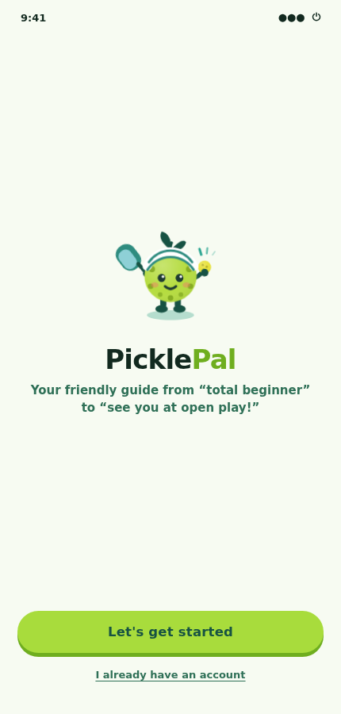
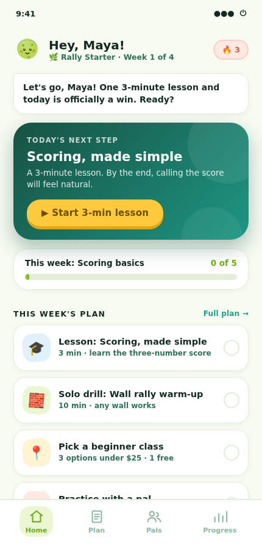
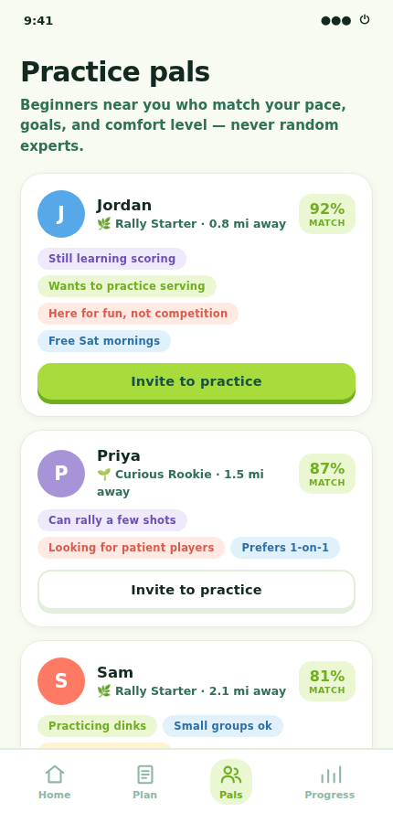
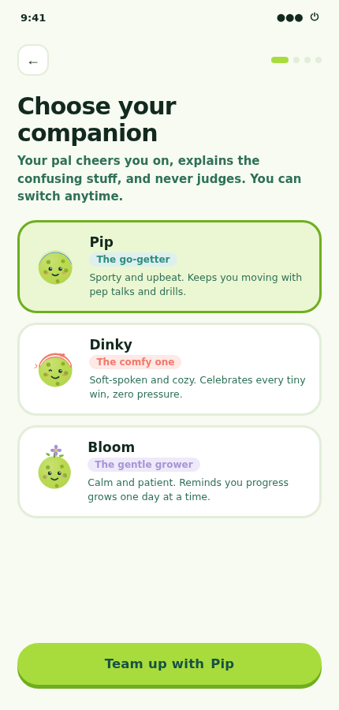
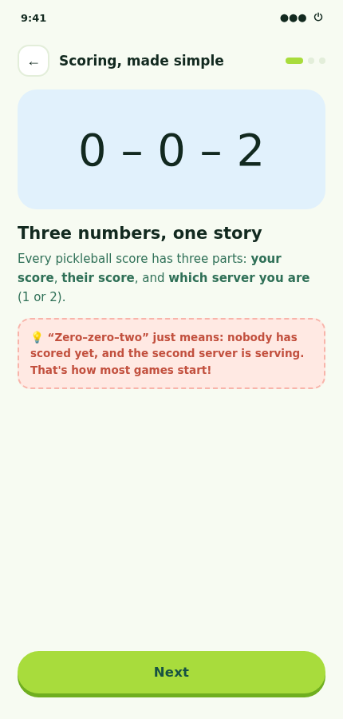
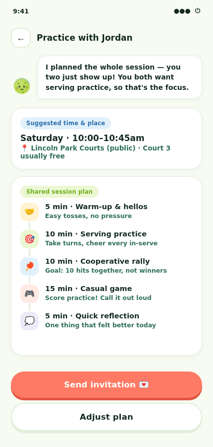
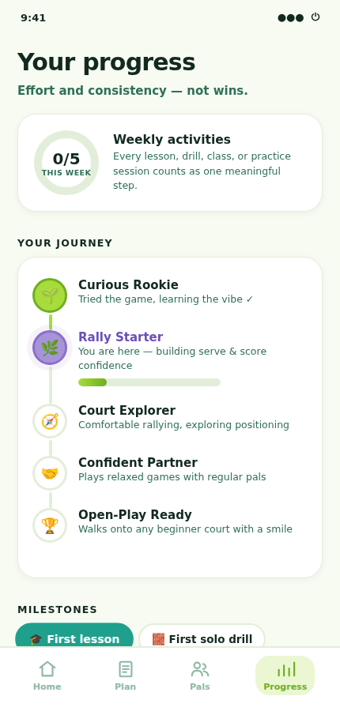

# 🥒 PicklePal — a supportive pickleball companion for beginners

**An interactive mobile-app prototype, designed and vibe-coded in an afternoon.**

PicklePal helps new pickleball players figure out what to practice, find affordable ways to improve, and meet other beginners — without the pressure of joining an experienced group. Think *Duolingo or Finch, but for pickleball*: structured, encouraging, playful, and designed to make progress feel achievable.

> **Product promise:** you never have to figure out your next step alone.

**[▶ Try the live prototype](https://codingstephy.github.io/picklepal/)** — click through the full journey in your browser.

<p align="center">
  
  
</p>

<p align="center"><em>Left: onboarding. Right: the core app. Or grab <a href="picklepal-demo.mp4">the full MP4</a>.</em></p>

<p align="center">
  
  
  
</p>

## The problem

Pickleball is easy to try but surprisingly hard to *continue* as a beginner. New players don't know what to practice first, whether a lesson is worth the price, or how to find patient people to play with. Existing sports apps assume you're already confident enough to organize a game. PicklePal doesn't — it helps you *become* that player.

## What's in the prototype

The prototype covers the full MVP journey from the product brief:

| Flow | What it shows |
|---|---|
| **Choose your companion** | Pick Pip, Dinky, or Bloom — your pal's voice changes across the whole app |
| **Beginner onboarding** | Goal, honest self-assessment, schedule, budget, and social comfort |
| **Friendly progression stages** | "Rally Starter" instead of intimidating skill ratings |
| **Personalized 4-week plan** | One skill focus per week; missed days reshuffle with zero guilt |
| **Bite-size lessons & drills** | A 3-minute scoring lesson and a 10-minute wall drill |
| **Budget-aware class discovery** | Every paid option paired with a free or cheaper alternative |
| **Beginner-safe matching** | Honest labels like "still learning scoring" and "looking for patient players" |
| **Guided practice sessions** | A shared session plan so meeting a stranger is never awkward |
| **Progress & milestones** | Effort and consistency over wins; privacy and safety controls |
| **PicklePal Plus** | The first 4-week plan is free forever; later stage plans are premium |

<p align="center">
  
  
  
  
</p>

## Design notes

- **Beginner-first**: no ratings, no jargon without explanation, no punishment mechanics
- **One clear next step**: the home screen always leads with a single "today's next step"
- **Visual language**: a blend of three explored brand directions — PicklePal's sporty lime mascot, DinkBuddy's cozy warmth, RallyBloom's calm lavender for progression
- **The mascot** on the landing screen is hand-drawn SVG, animated with pure CSS (bobbing body, swaying sprout, waving paddle, blinking eyes)

## Run it locally

No build step, no dependencies — it's a single self-contained HTML file.

```bash
git clone https://github.com/CodingStephy/picklepal.git
open picklepal/index.html
```

## How it was made

Designed and prototyped in a single Claude (Cowork) session: product brief + three AI-generated visual concepts in, working prototype out — iterating live on style, characters, animation, and monetization. Every flow was verified end-to-end with automated browser tests before shipping.

## Roadmap ideas

Lesson booking, video analysis, official rating import, leagues, and a coaching marketplace — intentionally out of scope for the MVP.

---

*Prototype only — not affiliated with any pickleball organization. Names, classes, and people are fictional.*
